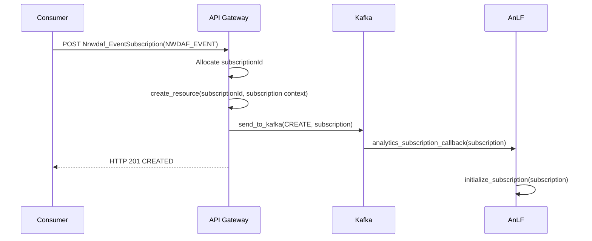
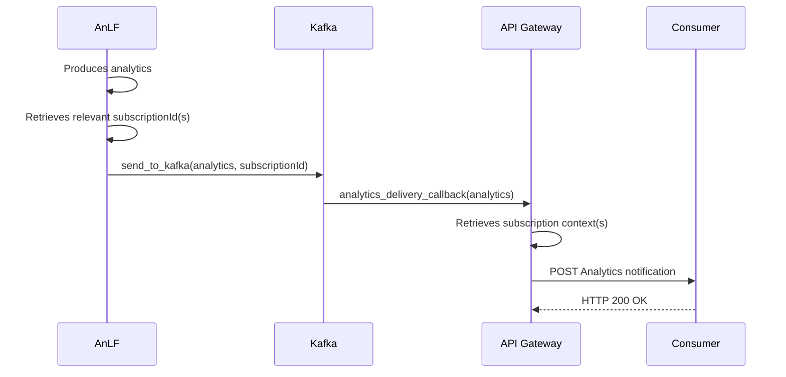
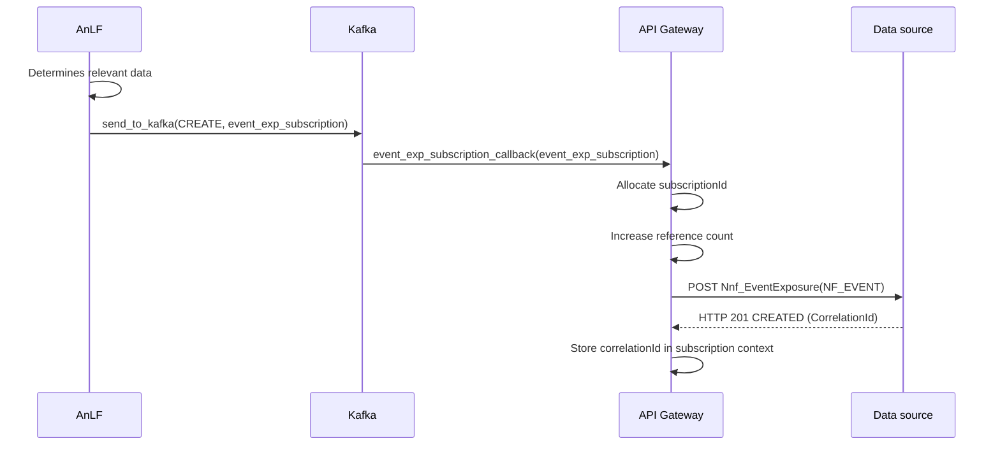
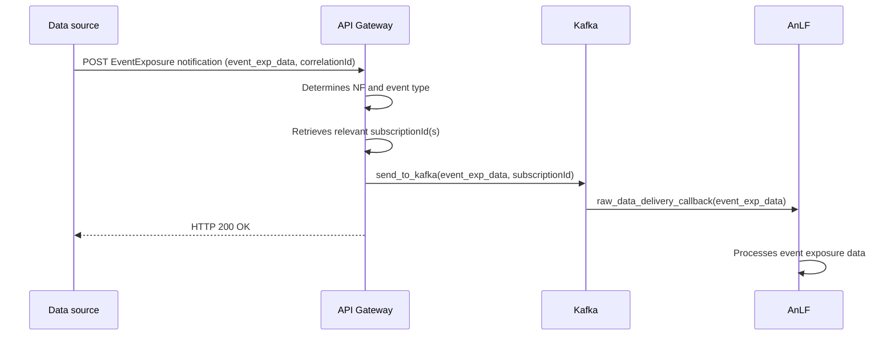
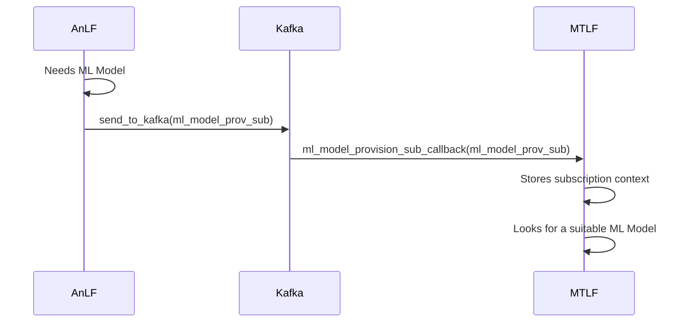
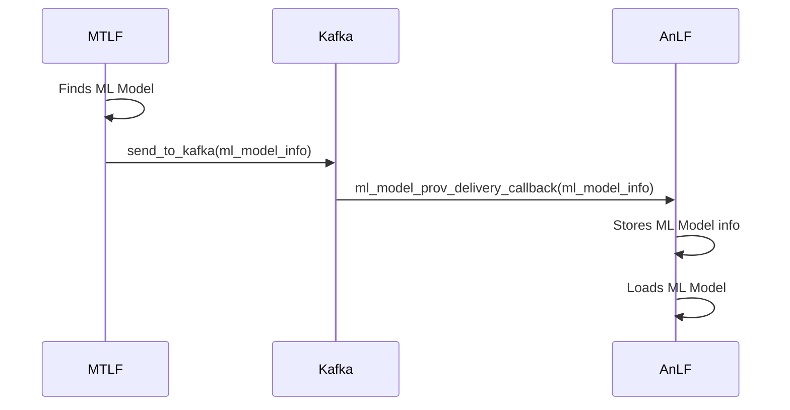

# Usage of *Kafka* topics in microservices *NWDAF*

## Overview

The following table summarizes the nomenclature of *Kafka* topics within our microservices *NWDAF* architecture:

| Operation                       | *Kafka* topic name                                 | Flow type |
|---------------------------------|----------------------------------------------------|-----------|
| Analytics subscription          | *Control.NwdafEventSubscription.NWDAF_EVENT*       | Control   |
| Analytics delivery              | *Data.NwdafEventDelivery.NWDAF_EVENT*              | Data      |
| Raw data subscription           | *Control.EventExposureSubscription.NF.NF_EVENT*    | Control   |
| Raw data delivery               | *Data.EventExposureDelivery.NF.NF_EVENT*           | Data      |
| ML Model provision subscription | *Control.MLModelProvisionSubscription.NWDAF_EVENT* | Control   |
| ML Model provision delivery     | *Data.MLModelProvisionDelivery.NWDAF_EVENT*        | Data      |

## Analytics

### Analytics subscription

> Control.NwdafEventSubscription._NWDAF_EVENT_

- The *API Gateway* exposes the *3GPP*-compliant endpoint
- Upon reception of an analytics subscription message, the *API Gateway* allocates a *subscriptionId* and stores the
  subscription parameters (e.g., *notificationUri*)
- The *API Gateway* has a hashmap where subscription contexts received in the *3GPP* message and *subscriptionId*s
  allocated by the *API Gateway* are stored. This hashmap will be used when analytics will be delivered.
- The *API Gateway* produces a new message on the relevant *Kafka* topic following the proposed nomenclature. The key is
  the type of operation to apply to the subscription (*CREATE*, *UPDATE* or *DELETE*). The value is the body of the
  *3GPP* message with the addition of the *subscriptionId* previously allocated
- The *AnLF* should already be subscribed to the relevant topic
- When the *AnLF* consumes a message on the topic, it should take care of the requested operation (*CREATE*, *UPDATE* or
  *DELETE*) and store the subscription parameters
- Ack: Kafka warns the producer when the subscription request message has been consumed by an AnLF
- When the subscription operation has been handled successfully, the *API Gateway* should reply *HTTP 201* to the
  analytics consumer with the response body described in the *3GPP* specifications
- If any error occurs during this operation, the *API Gateway* should reply with the relevant *HTTP* error code

### Analytics delivery

> Data.NwdafEventDelivery._NWDAF_EVENT_

- The *AnLF* should know which subscriptionId corresponds to the analytics it is producing
- When an analytic is produced, the *AnLF* produces a message on the relevant *Kafka* topic following the proposed
  nomenclature. The key is the *subscriptionId*, the value is a *3GPP*-compliant data structure containing the produced
  analytic
- The *API Gateway* should already be subscribed to the topic
- Upon reception of the *Kafka* message, the *API Gateway* checks in its hashmap which subscription context are paired
  with the received *subscriptionId*
- The *API Gateway* sends a *POST* request to all the endpoints corresponding to these subscription contexts. The *URI*s
  of these endpoints have been provided by the consumers during the analytics subscription operation, and stored by the
  *API Gateway*

## Event Exposure

### Raw data subscription

> Control.EventExposureSubscription._NF_._NF_EVENT_

- After handling the analytics subscription operation, the *AnLF* can trigger the relevant data collection operations
- The *AnLF* should have prior knowledge of which data it needs to collect to produce its analytics
- If a "complex" data collection is required (e.g., if we need to receive data *X* to be able to request data *Y*), the
  *AnLF* needs to have some kind of finite-state machine to handle it
- The *AnLF* produces a new message on the relevant *Kafka* topic following the proposed nomenclature. The key is the
  type of operation to apply to the subscription (*CREATE*, *UPDATE* or *DELETE*). The value is the body of the *3GPP*
  message
- The *API Gateway* should already be subscribed to the topic
- When the *API Gateway* consumes a message on the topic, it should take care of the requested operation (*CREATE*,
  *UPDATE* or *DELETE*) and store the subscription parameters
- Each stored subscription should be paired a reference count corresponding to the number of *AnLF*s requesting this
  exact same data. When consuming a message, if an equivalent subscription with the same parameters already exists, the
  reference count is increased
- Each subscription should have a *subscriptionId*, which is the paired by the *API Gateway* with the subscription's
  context
- When a subscription is first created, the *API Gateway* should send a *3GPP*-compliant *POST* request to the relevant
  *EventExposure* endpoint on the relevant *NF*. This request contains the *URI* of an endpoint served by the *API
  Gateway* to receive notifications, and the value of the *Kafka* message
- The data source responds with a *correlationId* identifying the subscription. This *correlationId* is stored in API
  Gateway along with the *subscriptionId*
- When a subscription is updated, we should determine if a new *POST* request should be sent or if a *PUT* request
  should be sent to update the *EventExposure* subscription. If several *AnLF*s are subscribed to one type of
  *EventExposure* data, an update by one *AnLF* should not impact the others
- When a subscription is deleted by an *AnLF*, the reference count is decreased. If it reaches *0*, we should send a
  *DELETE* on the *EventExposure* endpoint

### Raw data delivery

> Data.EventExposureDelivery._NF_._NF_EVENT_

- The *API Gateway* should serve an *HTTP* endpoint corresponding to the *EventExposure* notification *URI* provided
  during the raw data subscription operation
- When a notification is received, the *API Gateway* should know which *NF* it comes from and which type of event it
  pertains to
- The *API Gateway* produces a message containing the received raw data on the relevant topic following the proposed
  nomenclature. No key is needed in this case, the value is the contents of the notification message's body
- The *AnLF* should already be subscribed to the topic. This subscription can be initialized at the same time as the raw
  data subscription operation
- The *AnLF* receives the data and processes it in order to produce analytics
- When the *AnLF* deletes a raw data subscription, it should also stop consuming message on the corresponding raw data
  delivery topic

## ML Model Provision

### ML Model Provision subscription

> Control.MLModelProvisionSubscription._NWDAF_EVENT_

- The *AnLF* needs an _ML Model_ in order to perform an inference in order to produce _NWDAF_EVENT_ analytics
- The *AnLF* produces a subscription message containing a correlationId and eventual filters on the relevant _Kafka_
  topic
- The *MTLF* that provides the _ML Models_ pertaining to this type of analytics should already be subscribed to the topic
- The *MTLF* consumes the message coming from the AnLF, and stores the subscription context (including the
  correlationId)
- The *MTLF* starts looking for a suitable _ML Model_

### ML Model Provision delivery

> Data.MLModelProvisionDelivery._NWDAF_EVENT_

- An _ML Model_ suitable to a subscription becomes available
- The *MTLF* produces a message containing the _ML Model_ information (it could be a _URI_, a directory path, or the file
  itself) on the relevant topic
- The *AnLF* interested in _ML Models_ provided by the _MTLF_ should already be subscribed to the topic
- The *AnLF* consumes the message containing the _ML Model_ information, and stores it
- The *AnLF* loads the _ML Model_, which can then be used to perform inferences

