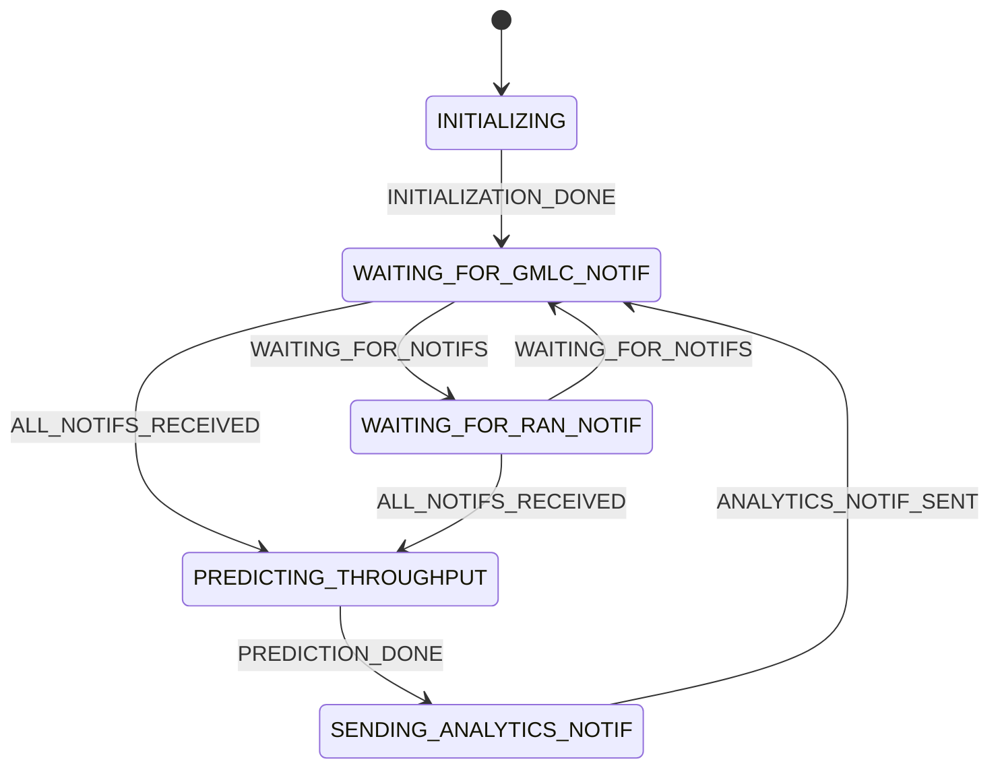

# Throughput AnLF

## Overview

The `ThroughputAnlfService` is a service designed to handle _UE_ throughput analytics in an _NWDAF_ microservice-based
architecture. It uses an [_LSTM_ model](https://merce-gitlab.fr-merce.mee.com/gitlab/merckube/merckube-lstm) to predict
a throughput value based on data collected from the _[GMLC](https://en.wikipedia.org/wiki/GMLC)_ and the
_[RAN](https://en.wikipedia.org/wiki/Radio_access_network)_.

## Requirements

* _Python_ ≥ 3.12 (preferably in a _virtualenv_, or using [Conda](https://anaconda.org/anaconda/conda))
* [nwdaf-api](https://merce-gitlab.fr-merce.mee.com/gitlab/wcs_nwdaf/nwdaf-3gpp-apis)
* [nwdaf-libcommon](https://merce-gitlab.fr-merce.mee.com/gitlab/wcs_nwdaf/nwdaf-libcommon)
* [FastAPI](https://github.com/fastapi/fastapi)
* [joblib](https://github.com/joblib/joblib)
* [Tensorflow](https://github.com/tensorflow/tensorflow)
* [Scikit Learn](https://github.com/scikit-learn/scikit-learn)

# How does it work?

Basic _AnLF_ operations (analytics subscription CRUD operations, event exposure mechanics, analytics delivery, _ML_
model provisioning, etc.) are
inherited from the `AnlfService` class from
the [nwdaf-libcommon](https://merce-gitlab.fr-merce.mee.com/gitlab/wcs_nwdaf/nwdaf-libcommon)
library.

Finite-state machines are used to handle subscriptions concurrently. Each subscription has its
own [FSM](https://merce-gitlab.fr-merce.mee.com/gitlab/wcs_nwdaf/nwdaf-libcommon/-/blob/main/src/nwdaf_libcommon/FiniteStateMachine.py)
with the
following states and transitions:

