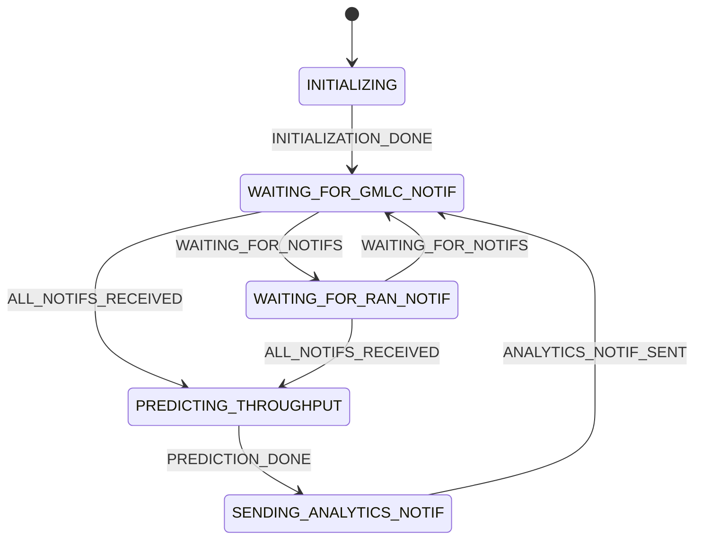

# Throughput AnLF

```mermaid
stateDiagram
    [*] --> INITIALIZING
    INITIALIZING --> WAITING_FOR_GMLC_NOTIF : INITIALIZATION_DONE
    WAITING_FOR_GMLC_NOTIF --> PREDICTING_THROUGHPUT : ALL_NOTIFS_RECEIVED
    WAITING_FOR_GMLC_NOTIF --> WAITING_FOR_RAN_NOTIF : WAITING_FOR_NOTIFS
    WAITING_FOR_RAN_NOTIF --> PREDICTING_THROUGHPUT : ALL_NOTIFS_RECEIVED
    WAITING_FOR_RAN_NOTIF --> WAITING_FOR_GMLC_NOTIF : WAITING_FOR_NOTIFS
    PREDICTING_THROUGHPUT --> SENDING_ANALYTICS_NOTIF : PREDICTION_DONE
    SENDING_ANALYTICS_NOTIF --> WAITING_FOR_GMLC_NOTIF : ANALYTICS_NOTIF_SENT
```